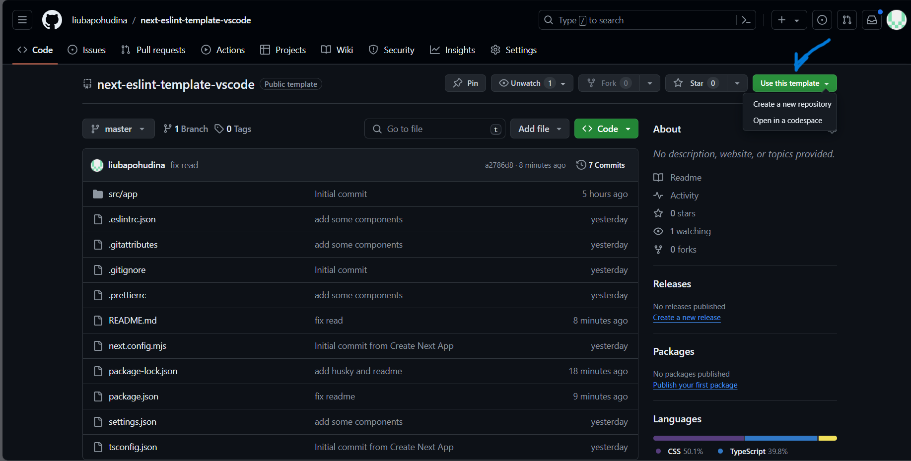

# Шаблон для React.js з Next.js

Цей шаблон створений для проектів на React.js з використанням Next.js. Репозиторій налаштовано з ESLint та Prettier для розробки додатків у VS Code. Також додано налаштування для автоматизації процесу форматування коду під час комітів.

## Використання:

1. Склонуйте репозиторій.

2. Виконайте команду `npm i` у терміналі.
3. Додайте власну комбінацію клавіш для форматування документів у VSCode.

### Додавання комбінації клавіш у VSCode

3.1. Відкрийте командне меню (`Ctrl + Shift + P`) і наберіть "Preferences: Open Keyboard Shortcuts (JSON)".

3.2. Додайте наступну комбінацію клавіш для форматування документа:

<pre>
<code>
[
  {
    "key": "ctrl+shift+f",
    "command": "editor.action.formatDocument",
    "when": "editorHasDocumentFormattingProvider && editorTextFocus && !editorReadonly"
  }
]
</code>
</pre>

## Початок роботи

Це проект на [Next.js](https://nextjs.org/), створений за допомогою [`create-next-app`](https://github.com/vercel/next.js/tree/canary/packages/create-next-app).

Спочатку запустіть сервер розробки:

```bash
npm run dev
# або
yarn dev
# або
pnpm dev
# або
bun dev
```

Якщо у вас вже є файл README.md англійською мовою, можна створити окремий файл для української версії документації. Зазвичай, такі файли називають, додаючи суфікс мови. Наприклад, для української мови можна використати назву README_uk.md. Ось ваш файл українською мовою:

markdown
Копіювати код
# Шаблон для React.js з Next.js

Цей шаблон створений для проектів на React.js з використанням Next.js. Репозиторій налаштовано з ESLint та Prettier для розробки додатків у VS Code. Також додано налаштування для автоматизації процесу форматування коду під час комітів.

## Використання:

1. Склонуйте репозиторій.
2. Виконайте команду `npm i` у терміналі.
3. Додайте власну комбінацію клавіш для форматування документів у VSCode.

### Додавання комбінації клавіш у VSCode

3.1. Відкрийте командне меню (`Ctrl + Shift + P`) і наберіть "Preferences: Open Keyboard Shortcuts (JSON)".

3.2. Додайте наступну комбінацію клавіш для форматування документа:

<pre>
<code>
[
  {
    "key": "ctrl+shift+f",
    "command": "editor.action.formatDocument",
    "when": "editorHasDocumentFormattingProvider && editorTextFocus && !editorReadonly"
  }
]
</code>
</pre>

## Початок роботи

Це проект на [Next.js](https://nextjs.org/), створений за допомогою [`create-next-app`](https://github.com/vercel/next.js/tree/canary/packages/create-next-app).

Спочатку запустіть сервер розробки:

```bash
npm run dev
# або
yarn dev
# або
pnpm dev
# або
bun dev
```
Відкрийте [http://localhost:3000](http://localhost:3000) у вашому браузері, щоб побачити результат.

Ви можете почати редагування сторінки, змінюючи `app/page.tsx`. Сторінка автоматично оновлюється під час редагування файлу.

Цей проект використовує next/font для автоматичної оптимізації та завантаження Inter, користувацького шрифту від Google.

## Дізнатися більше
Щоб дізнатися більше про Next.js, перегляньте наступні ресурси:

- [Next.js Documentation](https://nextjs.org/docs) - дізнайтеся про функції та API Next.js.
- [Learn Next.js](https://nextjs.org/learn) - інтерактивний підручник по Next.js.
Ви можете переглянути репозиторій [the Next.js GitHub repository](https://github.com/vercel/next.js/) - ваші відгуки та внески вітаються!

## Розгортання на Vercel
Найпростіший спосіб розгорнути ваш додаток на Next.js [Vercel Platform](https://vercel.com/new?utm_medium=default-template&filter=next.js&utm_source=create-next-app&utm_campaign=create-next-app-readme) використати Платформу Vercel від творців Next.js.

Перегляньте нашу документацію [Next.js deployment documentation](https://nextjs.org/docs/deployment) для отрмання деталів.